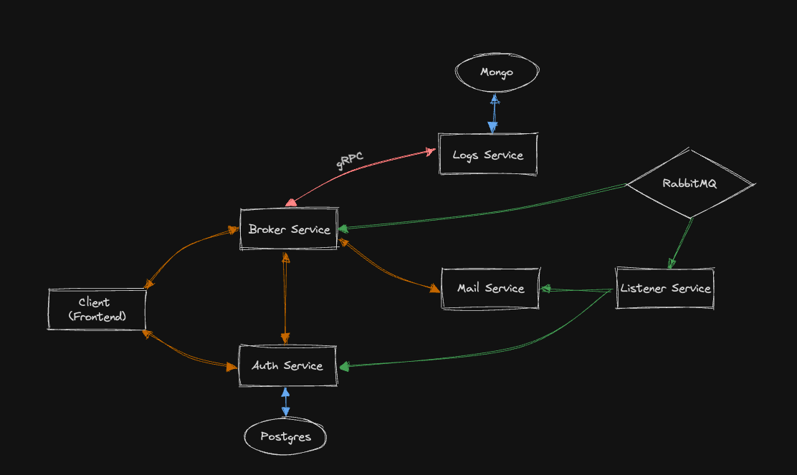

# Microservices with Go

The project utilizes Go, Kubernetes, RabbitMQ, MongoDB, Postgres, and a microservices architecture. It focuses on efficient data handling and processing, with RabbitMQ for message queuing, MongoDB and Postgres for database management, orchestrated via Kubernetes. The implementation in Go supports fast and effective system development, ensuring scalability and robustness.

